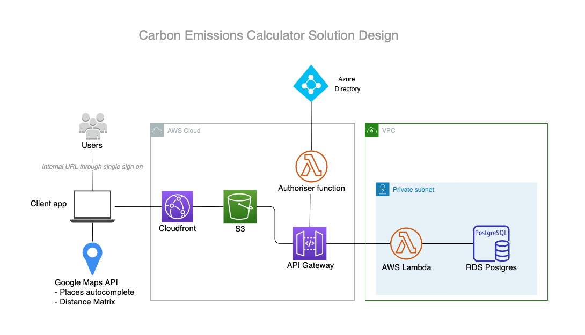
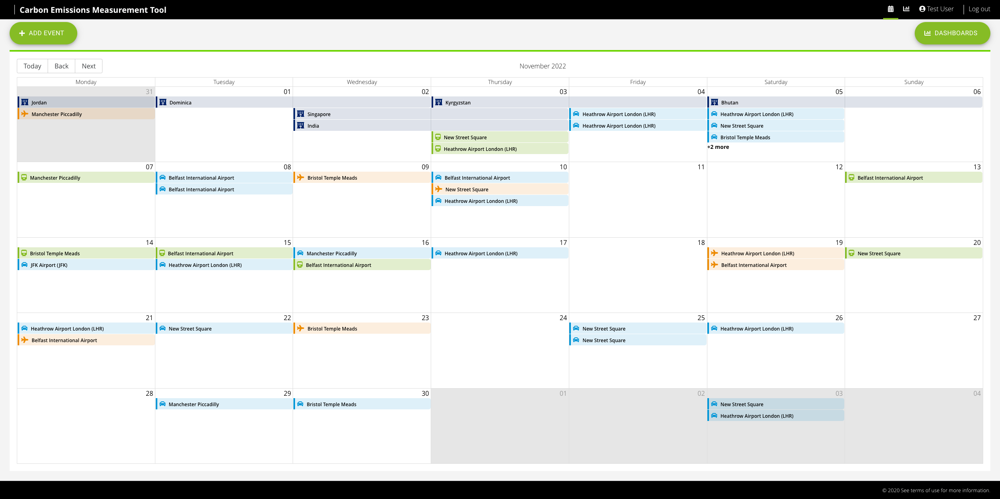
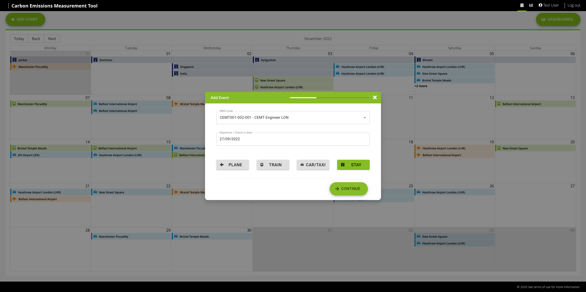
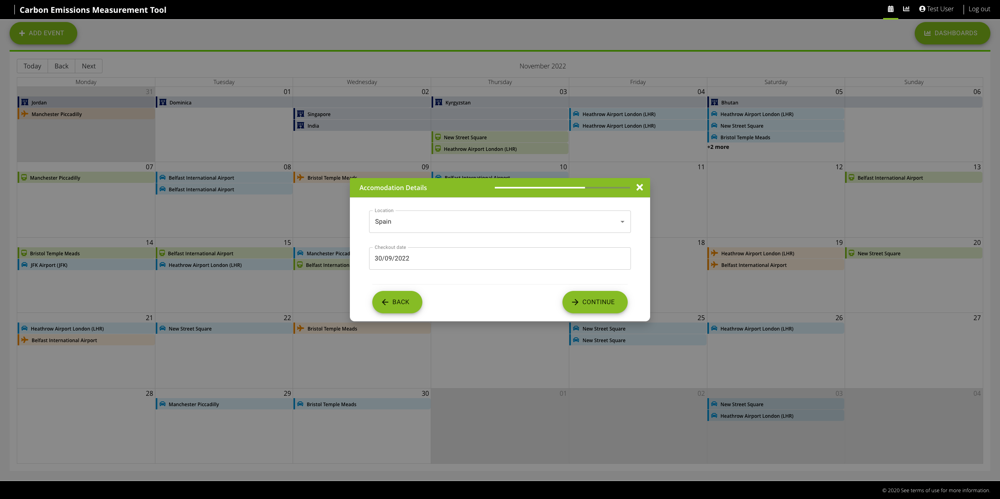
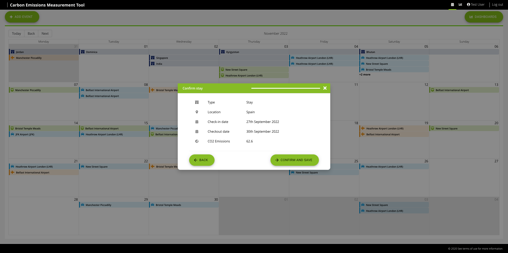
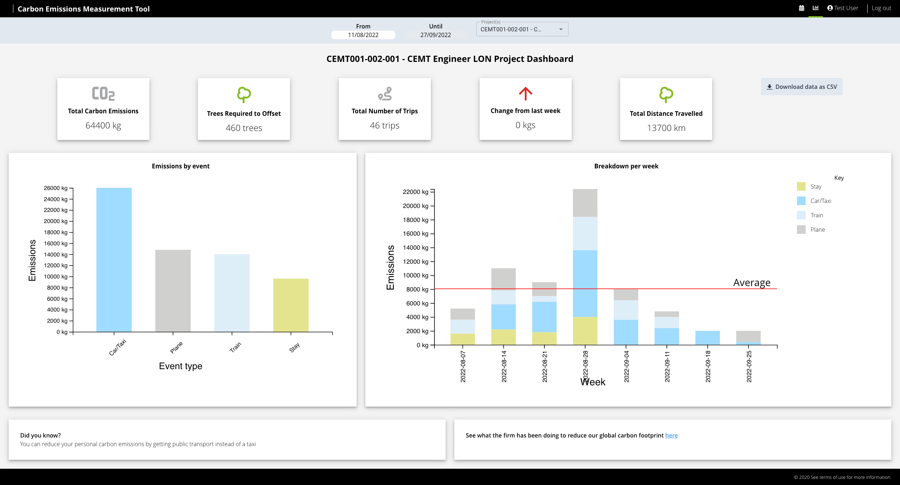

## The context

As a global consulting firm, Deloitte employees take a lot of business-related flights (I can't find where / who told me this but apparently we were the #1 buyer of airline tickets at one point). This is unsustainable and therefore we needed a way to incentivise projects to start looking at their travel-related emissions and try to drive behaviours to help reduce carbon emissions from travel.

A project was testing out a concept for a carbon calculator - based in an excel spreadsheet - that allowed users to record their travel arrangements and then a project co-ordinator would manually work out the carbon emissions calculations. This was providing the teams with useful insights into their emissions profile, but the process was extremely manual and did not scale easily to other teams.

## What was the problem being solved?

- No data available for teams to understand their travel emissions profile
- No data making it hard for teams to set targets and monitor progress against them
- Excel spreadsheet method was very manually intensive and required a lot of customisation for each project

## What was my role?

I joined up with the team behind the excel spreadsheet and together we conceptualised an online version of the spreadsheet, that:

- Allowed users to input their own travel arrangemennts
- Automatically ran the carbon calculations (using Google Distance API's)
- Visualised the emissions profile to enable data-driven action

From here I went away and created a solution design - which we could deploy into our internal cloud. I then developed the whole solution from scratch - working alongside a designer for some of the components and our product owner to ensure the functionality was meeting the expected requirements.

## Tech Stack

A serverless AWS application - configured and developed using the Serverless CLI tool:

- React single page application
- Node AWS lambdas
- RDS (PostgreSQL)

_Code coming soon - I just need to remove old secrets etc._

### Architecture Diagram

### Front End

- React + Typescript + Redux
- Material UI: _Quickly style components for the MVP_
- Tailwind CSS: _Testing tailwind for the first time and really found it very useful_
- D3.js: _To create the data visualisations_
- Cypress: _Trialling cypress for the first time for e2e journey testing_

### Back End

- Node + Typescript
- PostgreSQL

<!-- ## Challenges faced

### Security - User sign ins requiring authentication from Azure (to access app AND to access lambdas)

### Internal cloud constraint that database could not have public address

### Using a custom subdomain with cloudfront & s3 setup -->

## Screenshots of MVP

_The users calender view where they can view, add and edit any travel arrangements or hotel stays_

The user journey to add a travel arrangement or hotel stay

The user journey to add a hotel stay

The user is presented with a summary of their stay alongside the automated carbon calculations

The project wide dashboard to allow teams to monitor their emissions profiles
