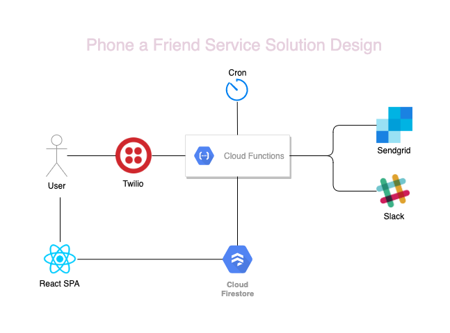
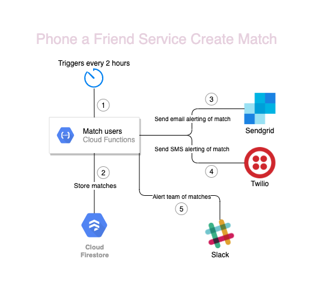
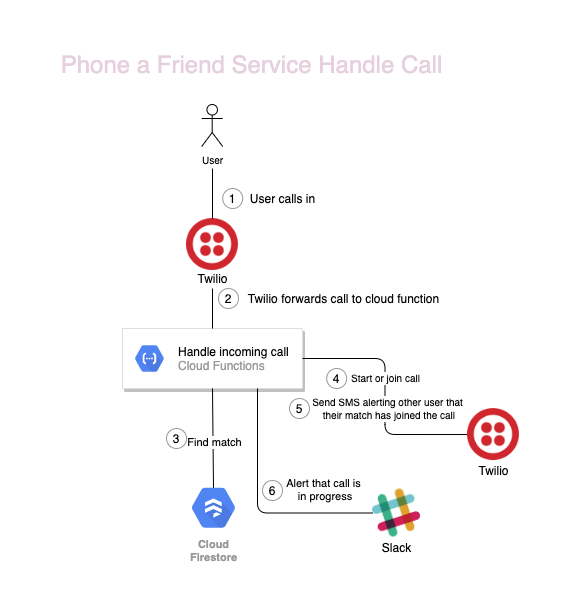

## The Context

During lockdown I joined Helpful Engineering, a community of engineers and designers that had come together at the start of the COVID lockdown to build tools and services to help those in need.

I was then approached by a student-run charity called CoronaUnity who were looking for a developer to support them with their Phone a Friend Service.

## What was the problem being solved?

Lockdown left many people completely socially isolated, impacting their wellbeing and mental health. They were just looking for someone to talk to, to give them that social contact that they were missing. 

## What was the Phone a Friend service?

The service was a platform whereby:
- volunteers could sign up to offer their free time to chat
- people who were feeling isolated and wanted to speak to someone could sign up to request a phone call from a volunteer

Users and volunteers would be matched based on their preferences and availability

## Features

- Matching based on preferences (gender, from a member of a charity)
- 2 hour time slots from 8am to 10pm every day
- Text and email notifications for successful matches and an alert once the phone call had started
- Phone numbers anonymised

## What was my role?

I architected the whole service and was responsible for all the backend functionality. Another team were working on the front end website and sign up form.

## Technology Stack

- Firebase Cloud Function (Node + Typescript): _Run all our backend logic, the matching function, sending texts, alerts and connecting calls_
- Twilio: _Handling calls, connecting calls and sending texts_
- Sendgrid: _Sending emails_
- Slack: _For pro-active alerting and monitoring_

_Code coming soon - I just need to remove old secrets etc._

### Solution Design

### Matching Function Flow

### Matching Function Flow

## Outcome

We ran the service for 3 months (May - August 2020), matching just over 300 users over this time period. The feedback from users was overwhelmingly positive, however we struggled to get funding to suppor the platform costs and as lockdown restrictions started to ease up in the summer, CoronaUnity decided to focus on other projects and ended up discontinuing the Phone a Friend service.

<!-- ## Challenges we faced -->
