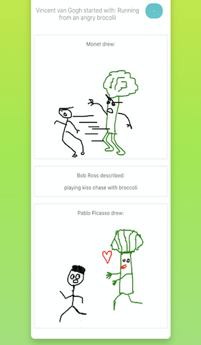

Give it a try! [Link to the game](https://doodle-game.io)

## What was the problem being solved?

The week before the full lockdown was enforced in the UK for Covid-19 in 2020 - I was in Cornwall with some friends on a little holiday. We were playing a lot of board games and one which we got very obsessed with was [Scrawl](https://boardgamegeek.com/boardgame/202982/scrawl). However once we got back - the lockdown started and so we weren't able to get together to play this game. Myself and a friend thought it would be possible to recreate the game online - and that is how Doodle was born.

It was a way for friends to connect and have fun whilst in lockdown.

## Technology Stack

- React + Typescript: _This has always been our preferred tech stack for building front end websites_
- Redux + Redux Observables + RxJS: _Having not done a lot of reactive programming with rxjs before we decided this project would be a great time to test it out_
- Firebase (Realtime DB, Firestore, Cloud Functions & Analytics): _Quick and easy backend and datastore to setup with a good free tier_
- Github Actions: _Free CI/CD pipeline where we could build, test and deploy our app to test and production environments_
- Surge: _For free and easy command-line deployments_

## Outcome

We released the first version of the game on the 20th May 2020 - and since then we've had players from over 70 countries. At the start uptake was mainly from friends and family, but after the first couple months we started hearing that many people were playing Doodle in their remote work socials as well. We stopped active development on the game in 2020, and currently just fix bugs and maintain the game.

<!-- ## Challenges we faced -->
